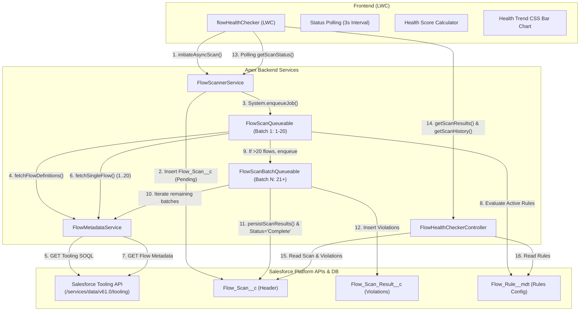

# Flow Health Checker — Comprehensive Project Status & Handoff Guide

> **Package Name**: Flow Health Checker  
> **Namespace**: `svfhc`  
> **Package Type**: Salesforce 2GP Managed Package  
> **Source API Version**: `61.0` (Summer '24)  
> **Current Version**: `0.11.0` (Package Id: `0HodL0000005NNNSA2`, Released Version Id: `04tdL000000o6obQAA`, Alias: `Flow Health Checker@0.11.0-1`)  
> **Installation URL**: `https://login.salesforce.com/packaging/installPackage.apexp?p0=04tdL000000o6obQAA`  
> **Target Audience**: Salesforce Developers, Technical Architects, AppExchange Reviewers, and Maintainers.

---

## Table of Contents

1. [Executive Summary & Purpose](#1-executive-summary--purpose)
2. [High-Level Architecture](#2-high-level-architecture)
3. [Data Model & Custom Metadata](#3-data-model--custom-metadata)
4. [Backend Implementation (Apex Architecture)](#4-backend-implementation-apex-architecture)
5. [Rules Engine Catalog (All 13 Rules)](#5-rules-engine-catalog-all-13-rules)
6. [Scoring Engine & Health Calculation](#6-scoring-engine--health-calculation)
7. [Frontend Architecture (Lightning Web Component)](#7-frontend-architecture-lightning-web-component)
8. [Package Lifecycle & Security Configuration](#8-package-lifecycle--security-configuration)
9. [Test Suite & Mock Architecture](#9-test-suite--mock-architecture)
10. [Resolved Issues & Bug Fixes](#10-resolved-issues--bug-fixes)
11. [Exhaustive Gap Analysis (What is Missing & Technical Debt)](#11-exhaustive-gap-analysis-what-is-missing--technical-debt)
12. [Developer Onboarding & Next Actionable Steps](#12-developer-onboarding--next-actionable-steps)

---

## 1. Executive Summary & Purpose

**Flow Health Checker** is a Salesforce Managed Package designed to audit, analyze, and grade an organization's active Flows against architecture best practices, governor-limit hazards, and UX anti-patterns.

### Primary Capabilities

- **Automated Metadata Extraction**: Connects internally to Salesforce Tooling API via REST callouts to discover all active `FlowDefinition` records and fetch complete JSON flow metadata without requiring external infrastructure.
- **Pluggable Rules Engine**: Evaluates flows across 12 extensible inspection rules implemented in Apex and configured dynamically via Custom Metadata Types (`Flow_Rule__mdt`).
- **Asynchronous Execution & Scaling**: Uses chained `Queueable` Apex (`FlowScanQueueable` & `FlowScanBatchQueueable`) with batch slicing (20 flows per batch) to bypass heap, CPU, and callout governor limits in enterprise orgs with hundreds of flows.
- **Interactive UI Dashboard**: Modern Lightning Web Component (`flowHealthChecker`) featuring real-time scan polling, score summary cards, searchable/filterable flow violation groups, direct deep-links to Salesforce Flow Builder, rule reference modals, and historical trend charts.

---

## 2. High-Level Architecture



---

## 3. Data Model & Custom Metadata

### 3.1 Custom Objects

#### `Flow_Scan__c` (Scan Run Header)

Tracks the execution lifecycle, metrics, and high-level summary of each scan run.

| Field API Name           | Data Type             | Purpose & Details                                                             |
| ------------------------ | --------------------- | ----------------------------------------------------------------------------- |
| `Scan_Date__c`           | `DateTime`            | Timestamp when the scan was executed.                                         |
| `Status__c`              | `Picklist`            | Lifecycle state: `Pending`, `Running`, `Complete`, `Failed`.                  |
| `Total_Flows_Scanned__c` | `Number(5, 0)`        | Count of active flow definitions inspected during the scan.                   |
| `Total_Violations__c`    | `Number(6, 0)`        | Total number of rule violations flagged across all flows.                     |
| `Errors__c`              | `Number(5, 0)`        | Total count of high-severity rule violations.                                 |
| `Warnings__c`            | `Number(5, 0)`        | Total count of medium-severity rule violations.                               |
| `Affected_Flows__c`      | `Number(5, 0)`        | Distinct count of flows with at least 1 violation.                            |
| `Health_Score__c`        | `Percent(5, 2)`       | Persisted org-level health score percentage calculated upon scan completion.  |
| `Error_Message__c`       | `LongTextArea(32768)` | Captures callout/parsing exception stack traces when `Status__c == 'Failed'`. |

#### `Flow_Scan_Result__c` (Violation Detail)

Stores individual rule violations identified during a scan.

- **`Flow_Scan__c`** (`Lookup(Flow_Scan__c)`): Relates the violation back to the parent scan record.
- **`Flow_API_Name__c`** (`Text(255)`): API Name of the affected flow (e.g. `Account_After_Save_Sync`).
- **`Flow_Definition_Id__c`** (`Text(18)`): 18-character Tooling API `FlowDefinition` ID (used for Flow Builder deep-linking).
- **`Rule_Name__c`** (`Text(255)`): Friendly name of the violated rule (e.g., `DML In Loop`).
- **`Severity__c`** (`Text(50)`): Severity level: `Error`, `Warning`, or `Info`.
- **`Element_Name__c`** (`Text(255)`): Name of the specific flow element (Action, Screen, Assignment, DML node) causing the violation.
- **`Description__c`** (`LongTextArea(32768)`): Detailed violation explanation and actionable remediation advice.

### 3.2 Custom Metadata Type: `Flow_Rule__mdt`

Controls active rule registration, severities, and descriptions dynamically without code modifications.

- **`Rule_Type__c`** (`Text(100)`): Apex class name implementing `IFlowRule` (e.g., `DmlInLoopRule`).
- **`Severity__c`** (`Text(50)`): Default rule severity (`Error`, `Warning`, `Info`).
- **`Active__c`** (`Checkbox`): Enables or disables the rule globally during scans.
- **`Description__c`** (`LongTextArea(1000)`): User-facing description explaining the rule rationale.

---

## 4. Backend Implementation (Apex Architecture)

### 4.1 Class Inventory

| Class Name                    | Type         | Access Level          | Description                                                                                                                                                              |
| ----------------------------- | ------------ | --------------------- | ------------------------------------------------------------------------------------------------------------------------------------------------------------------------ |
| `FlowMetadataService`         | Service      | `public with sharing` | Handles REST callouts to Salesforce Tooling API to query `FlowDefinition` and retrieve raw Flow metadata JSON. Sanitizes responses and populates `FlowWrapper`.          |
| `FlowScannerService`          | Service      | `public with sharing` | Factory for loading active rules from `Flow_Rule__mdt`, initiating scans, polling status, and persisting `Flow_Scan__c` and `Flow_Scan_Result__c` records.               |
| `FlowScanQueueable`           | Asynchronous | `public with sharing` | First-stage Queueable job (`Database.AllowsCallouts`). Queries flow list, processes batch 1 (up to 20 flows), and delegates remaining flows to `FlowScanBatchQueueable`. |
| `FlowScanBatchQueueable`      | Asynchronous | `public with sharing` | Chained Queueable job (`Database.AllowsCallouts`). Processes remaining flows in chunks of 20, chaining itself until complete, then commits violations to database.       |
| `FlowHealthCheckerController` | Controller   | `public with sharing` | `@AuraEnabled` endpoints consumed by LWC (`getScanResults`, `getRules`, `getScanHistory`). Enforces CRUD/FLS accessibility checks.                                       |
| `FlowWrapper`                 | Data Model   | `public`              | Object-oriented representation of Flow metadata (elements, loops, variables, subflows, start triggers, fault connectors, connected reachability graph).                  |
| `RuleViolation`               | Data Model   | `public`              | Container representing an evaluated rule violation (rule name, severity, element name, description, flow definition Id).                                                 |
| `IFlowRule`                   | Interface    | `public`              | Standard interface (`List<RuleViolation> evaluate(FlowWrapper flow)`) implemented by all 13 rules.                                                                       |
| `FHCPostInstallScript`        | Lifecycle    | `public`              | `InstallHandler` implementation. Automatically assigns `FHC_Admin` permission set to the user installing/upgrading the package.                                          |
| `FHCUninstallHandler`         | Lifecycle    | `public`              | `UninstallHandler` implementation. Purges all scan history and violation records upon package uninstallation to ensure clean removal.                                    |

### 4.2 Core Data Structures (`FlowWrapper`)

`FlowWrapper` decouples the rules engine from raw Tooling API JSON:

- `elements`: List of `FlowElementWrapper` (captures `name`, `elementType`, `parentLoopName`, `hasFaultConnector`, `isOnFaultPath`, `rawValue`, `objectName`, `fieldCount`, `calledFlowApiName`).
- `variables`: List of `FlowVariableWrapper` (captures `name`, `dataType`, `isInput`, `isOutput`).
- `subflows`: List of subflow elements with `calledFlowApiName`.
- `connectedElements`: `Set<String>` of all element names reachable by traversing connectors from the flow's `start` node.
- `startConfig`: `FlowStartWrapper` (`triggerType`, `objectApiName`, `recordTriggerType`).

---

## 5. Rules Engine Catalog (All 12 Rules)

The package implements 12 inspection rules registered in `FlowScannerService.RULE_TYPE_MAP`:

| #   | Rule Class                | Metadata Label           | Severity    | Detection Logic & Best Practice Rationale                                                                                                                                                                                                     |
| --- | ------------------------- | ------------------------ | ----------- | --------------------------------------------------------------------------------------------------------------------------------------------------------------------------------------------------------------------------------------------- |
| 1   | `DmlInLoopRule`           | `DML In Loop`            | **Error**   | Flags `RecordCreate`, `RecordUpdate`, `RecordDelete`, and `RecordLookup` nodes that have a non-blank `parentLoopName`. Prevents hitting the 150 DML / 100 SOQL governor limits when iterating over collections.                               |
| 2   | `DuplicateDmlRule`        | `Duplicate DML`          | **Warning** | Identifies multiple DML operations (`RecordCreate`, `RecordUpdate`, `RecordDelete`) executed against the same SObject type within the same flow outside of loops. Recommends combining operations into a single collection DML.               |
| 3   | `HardcodedIdRule`         | `Hardcoded Id`           | **Error**   | Uses regular expressions to detect 15- or 18-character Salesforce record IDs within element JSON definitions, ignoring known non-record prefixes (`000`, `001`, `006`). Prevents deployment breakage across Sandboxes and Production.         |
| 4   | `HardcodedUrlRule`        | `Hardcoded URL`          | **Warning** | Scans element raw JSON for absolute HTTP/HTTPS URLs, whitelisting standard Salesforce system domains (`salesforce.com`, `force.com`, `cloudfront.net`, `schema.org`, `w3.org`, `xmlsoap.org`). Recommends Named Credentials or Custom Labels. |
| 5   | `MissingDescriptionRule`  | `Missing Description`    | **Warning** | Checks if `flow.description` is null or whitespace. Ensures maintainability and documentation for org administrators.                                                                                                                         |
| 6   | `NoFaultPathRule`         | `No Fault Path`          | **Error**   | Checks DML and callout elements (`RecordCreate`, `RecordUpdate`, `RecordDelete`, `ActionCall`, `ApexPluginCall`) to ensure they define a `faultConnector` target, unless the element is already situated on another element's fault path.     |
| 7   | `NoTriggerConfigRule`     | `No Trigger Config`      | **Warning** | Checks automated process types (`AutoLaunchedFlow`, `RecordTriggeredFlow`, `ScheduledFlow`) to ensure the `start` element specifies a valid `triggerType` and `objectApiName`.                                                                |
| 8   | `RecursiveSubflowRule`    | `Recursive Subflow`      | **Error**   | Checks `subflow` elements where `calledFlowApiName == flow.flowApiName`. Flags direct circular self-invocations that cause infinite recursion and CPU timeout limits.                                                                         |
| 9   | `TooManyElementsRule`     | `Too Many Elements`      | **Warning** | Flags flows whose total element count exceeds the threshold (configured default: 30 elements). Recommends breaking monolithic flows into subflows.                                                                                            |
| 10  | `TooManyScreenFieldsRule` | `Too Many Screen Fields` | **Warning** | Evaluates `Screen` elements where the number of input/display fields exceeds the threshold (default: 10). Recommends multi-screen guided flows for better user completion rates.                                                              |
| 11  | `UnconnectedElementRule`  | `Unconnected Element`    | **Warning** | Compares all elements against the `connectedElements` reachability set built from the Start node. Flags orphan elements and dead code.                                                                                                        |
| 12  | `UnusedVariableRule`      | `Unused Variable`        | **Warning** | Checks non-input, non-output variables whose names never appear in any element's serialized JSON definition. Prevents metadata clutter.                                                                                                       |

---

## 6. Scoring Engine & Health Calculation

### 6.1 Formula Specification

The org-level Health Score (0% to 100%) is calculated using an inverse penalty deduction model that normalizes penalties relative to org size:

$$\text{Error Points} = \min\left(\text{Errors} \times \left(\frac{100}{\text{Total Flows}}\right) \times 0.60,\, 100\right)$$

$$\text{Warning Points} = \min\left(\text{Warnings} \times \left(\frac{100}{\text{Total Flows}}\right) \times 0.20,\, 100\right)$$

$$\text{Health Score} = \max\left(0,\, \text{round}\left(100 - \text{Error Points} - \text{Warning Points}\right)\right)$$

### 6.2 Key Scoring Characteristics

- **3:1 Severity Weighting**: Errors incur 3× greater penalty deduction ($0.60$) than Warnings ($0.20$).
- **Scale Normalization**: A single violation in a 2-flow org impacts the score significantly more than 1 violation in a 200-flow enterprise org.
- **Color Thresholds**:
  - $\ge 80\%$: **Green (Healthy)**
  - $50\% - 79\%$: **Amber (Needs Review / Warning)**
  - $< 50\%$: **Red (Critical)**

---

## 7. Frontend Architecture (Lightning Web Component)

### Component: `c-flow-health-checker`

#### Key Modules & Capabilities

1. **Interactive Control Bar**:
   - `Run Scan` button with inline spinner, disabled states, and dynamic ARIA accessibility labels.
   - `View Rules` button opening a modal with all 13 rules, severity chips, and descriptions.
   - `History` button displaying a CSS bar-trend visualization and historical scan comparison table.
2. **Real-Time Progress State**:
   - Displays animated progress indicator with cycling status messages (`Connecting to Tooling API...`, `Checking for fault paths...`, `Scanning for DML in loops...`).
3. **Summary Metric Banner**:
   - 5 KPI Cards: Total Flows Scanned, Errors, Warnings, Health Score %, and Affected Flows count.
   - Interactive tooltip popovers explaining calculation logic.
4. **Grouped Violation Explorer**:
   - Violations grouped by Flow API Name with collapsible accordions.
   - Flow-level health status badge (`Critical`, `Needs Review`, `Healthy`).
   - "↗ Open Flow" deep-link button opening Salesforce Flow Builder (`/builder_platform_interaction/flowBuilder.app?flowDefId=...`).
   - Violation table displaying Severity badge (`🔴 Error`, `🟡 Warning`, `🔵 Info`), Rule Name, Element Name, and Description.
5. **Search & Filter Controls**:
   - Instant search by flow API name.
   - Severity filters (`All`, `Error`, `Warning`, `Info`).
   - `Expand All` and `Collapse All` batch toggle buttons.
   - Full keyboard navigation support (Space / Enter on accordion headers).

---

## 8. Package Lifecycle & Security Configuration

### 8.1 Permission Sets

#### `FHC_Admin`

- **Target Persona**: Salesforce Administrators and Release Managers.
- **Permissions**:
  - Apex Class Access: `FlowHealthCheckerController`, `FlowMetadataService`, `FlowScanQueueable`, `FlowScannerService`.
  - Object Permissions: Read/Create/Edit on `Flow_Scan__c` (View All); Read/Create on `Flow_Scan_Result__c` (View All).
  - System Permission: `ApiEnabled`.
  - Custom Tab: `Flow_Scan__c` visible.

#### `FHC_Viewer`

- **Target Persona**: Auditors, QA, and Business Analysts.
- **Permissions**: Read-only access to `Flow_Scan__c` and `Flow_Scan_Result__c`. No permissions to execute scans.

### 8.2 Lifecycle Scripts

- **Post-Install (`FHCPostInstallScript`)**: Automatically assigns `FHC_Admin` to the user executing the install or upgrade. Fails silently with error logs to prevent blocking package installation.
- **Uninstall Handler (`FHCUninstallHandler`)**: Automatically purges all records in `Flow_Scan_Result__c` and `Flow_Scan__c` (up to 10,000 records) to prevent uninstall blocking.

### 8.3 Lightning Navigation & Flexipages

- Lightning App: `Flow_Health_Checker` (`Flow_Health_Checker.app-meta.xml`).
- App Page: `Flow_Health_Checker.flexipage-meta.xml` hosting `c-flow-health-checker`.
- Custom Tab: `Flow_Health_Checker.tab-meta.xml`.

### 8.4 AppExchange Security Review Compliance

- Comprehensive security review audit and policy checklist documented in 👉 **[`APPEXCHANGE_SECURITY_REVIEW.md`](./APPEXCHANGE_SECURITY_REVIEW.md)**.
- Covers CRUD/FLS validation, `with sharing` architecture, SOQL/XSS/CSRF injection protection, in-memory session handling, Tooling API callout loopbacks, and least-privilege permission sets.

---

## 9. Test Suite & Mock Architecture

### 9.1 Apex Test Inventory

| Test Class                        | Target Class                                   | Methods Covered | Key Scenarios                                                                                                                                                                                                                                                                                                                                                                                    |
| --------------------------------- | ---------------------------------------------- | --------------- | ------------------------------------------------------------------------------------------------------------------------------------------------------------------------------------------------------------------------------------------------------------------------------------------------------------------------------------------------------------------------------------------------ |
| `FlowRulesTest`                   | All 12 Rule Classes & `FlowWrapper`            | 27 test methods | Positive and negative violation evaluation for every rule, boundary checks (e.g. threshold limits), null/empty payload handling, nested loops, fault paths, subflow non-trigger validation, null label fallbacks.                                                                                                                                                                                |
| `FlowHealthCheckerControllerTest` | `FlowHealthCheckerController`                  | 9 test methods  | Permission validation, scan retrieval with and without results, rule retrieval, severity ordering, scan history sorting and limit capping.                                                                                                                                                                                                                                                       |
| `FlowScannerServiceTest`          | `FlowScannerService` & `FlowMetadataService`   | 13 test methods | Async scan initiation, status retrieval (`Running`/`Complete`), rule loading, violation persistence, mathematical health score calculation, Tooling API mock callouts, Named Credential callout routing, missing session ID exception handling, complex flow graph reachability (startElementReference, defaultConnector, scheduledPaths, waitEvents), empty org handling, API error exceptions. |
| `FlowScanQueueableTest`           | `FlowScanQueueable` & `FlowScanBatchQueueable` | 6 test methods  | Full Queueable execution, session ID forwarding across constructors, API failure handling, empty flow org handling, null scan Id catch blocks, multi-violation aggregation.                                                                                                                                                                                                                      |
| `FlowScanBatchQueueableTest`      | `FlowScanBatchQueueable`                       | 6 test methods  | Single batch processing, empty remaining list, full chain execution, accumulated violation carrying, null description flows.                                                                                                                                                                                                                                                                     |
| `FHCPostInstallScriptTest`        | `FHCPostInstallScript`                         | 4 test methods  | Fresh install assignment, upgrade scenario, null installer context, idempotency check (already assigned).                                                                                                                                                                                                                                                                                        |
| `FHCUninstallHandlerTest`         | `FHCUninstallHandler`                          | 2 test methods  | Successful data cleanup on uninstall, empty org handling.                                                                                                                                                                                                                                                                                                                                        |

**Total Apex Test Suite**: 94 unit test methods | **Pass Rate**: 100% | **Org-Wide Code Coverage**: 94%

### 9.2 LWC Jest Test Inventory (`flowHealthChecker.test.js`)

| #   | Test Scenario                                                  | Description                                                                                                                                                    |
| --- | -------------------------------------------------------------- | -------------------------------------------------------------------------------------------------------------------------------------------------------------- |
| 1   | `renders initial default state correctly`                      | Verifies header title, action buttons, initial summary card dashes/zeros, and "Ready to scan" illustration render when no scan has run.                        |
| 2   | `executes scan and displays results on poll completion`        | Tests clicking "Run Scan", initiating async scan, polling progress messages, transition to 'Complete', and rendering flow violation groups & metadata summary. |
| 3   | `handles scan failure and displays error banner`               | Asserts that when a scan fails during polling, an error banner is displayed with the exact error message.                                                      |
| 4   | `filters flow groups by severity button clicks`                | Validates interactive filtering by `Error`, `Warning`, and `All` severity buttons.                                                                             |
| 5   | `filters flow groups by search input`                          | Tests real-time debounced filtering of flow groups as the user types a flow API name.                                                                          |
| 6   | `toggles flow group expansion and handles expand/collapse all` | Verifies clicking flow group headers, keyboard navigation (`Enter`/`Space`), "Expand all", and "Collapse all" buttons.                                         |
| 7   | `renders Open Flow button and triggers navigation logic`       | Tests presence of "↗ Open Flow" for flow definition IDs and verifies standard web page deep link navigation.                                                   |
| 8   | `opens and closes Rules modal`                                 | Validates retrieving rules via `getRules` and opening/closing the modal dialog.                                                                                |
| 9   | `opens and closes History modal`                               | Tests retrieving scan history via `getScanHistory` and rendering trend bars and history table.                                                                 |
| 10  | `correctly calculates health score mathematically`             | Comprehensive unit tests of the mathematical health score formula across clean orgs, weighted penalties, and boundary conditions.                              |

**Total Jest Test Suite**: 10 test suites / test cases | **Pass Rate**: 100%

---

## 10. Resolved Issues & Bug Fixes

The following issues were identified and resolved:

1. **Unconnected Element False Positives on Screen Flows & Decision Branches (`UnconnectedElementRule`)**:
   - _Root Cause_: `FlowMetadataService.buildConnectedSet()` omitted top-level `startElementReference`, `start.scheduledPaths`, and Decision `defaultConnector` targets. In addition, only a flat set of target references was collected rather than a full graph reachability traversal from Start.
   - _Fix_: Implemented BFS reachability traversal starting from all entry roots (`startElementReference`, `start.connector`, `start.scheduledPaths`) across all element types and connectors (including `defaultConnector` for decisions and waits).
2. **Flow "null" Label Display in Warnings (`TooManyElementsRule`, `MissingDescriptionRule`, etc.)**:
   - _Root Cause_: Tooling API response serialization converted `null` `MasterLabel` to the literal string `'null'`, which was displayed directly in violation messages.
   - _Fix_: Added null-safe string conversion and fallbacks to Flow Metadata `label` or `flowApiName` across `FlowMetadataService`, `TooManyElementsRule`, `MissingDescriptionRule`, and `NoTriggerConfigRule`.
3. **False Positive Violations on Autolaunched Subflows (`NoTriggerConfigRule`)**:
   - _Root Cause_: Salesforce standard subflows use `processType = 'AutoLaunchedFlow'` without triggers. `NoTriggerConfigRule` was erroneously requiring triggers on all autolaunched flows.
   - _Fix_: Adjusted `NoTriggerConfigRule` to only flag flows where `processType == 'RecordTriggeredFlow'` or where a record trigger type is configured but no target SObject is specified. Standard reusable subflows are no longer flagged.
4. **Namespace Resilience in Apex & LWC**:
   - _Root Cause_: Hardcoded `svfhc__` prefix in `FlowHealthCheckerController.getRules()` and strict property access in `flowHealthChecker.js`.
   - _Fix_: Removed hardcoded namespace prefix from Apex SOQL and added dynamic property fallbacks (`svfhc__Field__c || Field__c`) across LWC JavaScript.
5. **False Positive Error on Subflows Missing Fault Path (`SubflowFaultPathRule`)**:
   - _Root Cause_: Salesforce Flow Builder does not support configuring fault connectors on Subflow element nodes. Requiring fault paths on subflow nodes flagged 100% of standard subflows as critical errors.
   - _Fix_: Deactivated `SubflowFaultPathRule` in Custom Metadata (`Active__c = false`) and updated `SubflowFaultPathRule.cls` to return an empty list. Error handling for subflows is managed within the child subflow itself.
6. **Tooling API Authentication & Session Resolution for Lightning Experience (`INVALID_SESSION_ID`)**:
   - _Root Cause_: In Salesforce Lightning Experience, `UserInfo.getSessionId()` called within `@AuraEnabled` methods returns a restricted Lightning UI session token. Salesforce deliberately prevents Lightning UI session tokens from accessing the REST/Tooling API (`INVALID_SESSION_ID: This session is not valid for use with the REST API`).
   - _Fix_: Created the `SessionHelper.page` Visualforce component utilizing `{!$Api.Session_ID}`. Implemented `FlowScannerService.getApiSessionId()` to extract a full API-enabled session token via `PageReference.getContent()` prior to enqueuing the Queueable chain, with seamless fallback across namespaced (`svfhc__`) and local packages, permission set access granting in `FHC_Admin` and `FHC_Viewer`, and Named Credential fallback support (`callout:FlowHealthToolingApi`).
7. **Health Score Persistence on `Flow_Scan__c`**:
   - _Root Cause_: `Health_Score__c` was previously computed purely in JavaScript, preventing standard Salesforce reporting and dashboard tracking.
   - _Fix_: Created `Health_Score__c` (`Percent(5, 2)`) custom field, granted permissions in `FHC_Admin` and `FHC_Viewer`, populated `Health_Score__c` in `FlowScannerService.persistScanResults()`, queried it in `FlowHealthCheckerController`, and updated LWC UI & history modal to utilize the persisted score.
8. **Missing LWC Jest Unit Test Suite**:
   - _Root Cause_: `flowHealthChecker.test.js` only contained an empty template.
   - _Fix_: Created 10 comprehensive Jest unit tests covering all UI states, scan initiation, polling, error banners, search, filtering, expand/collapse, navigation, modal interactions, and mathematical formula calculation.

---

## 11. Exhaustive Gap Analysis (What is Missing & Technical Debt)

While the core functionality, packaging architecture, and test coverage are robust, the following gaps, technical debt, and missing features remain on the roadmap for future enhancements:

### 11.1 Medium Priority (Functional & Engine Enhancements)

1. **Automated Scheduled Scanning**:
   - **Current State**: Scans are triggered manually via the "Run Scan" button in the LWC dashboard.
   - **Enhancement**: Create a `Schedulable` Apex class (`FlowHealthScheduledScanner`) allowing admins to schedule recurring nightly/weekly health audits.

2. **Email & Chatter Health Alerts**:
   - **Current State**: Scan results are stored in custom objects without outbound notifications.
   - **Enhancement**: Automated notification (Email digest or Custom Notification) sent to admins when the health score drops below a configured threshold or when critical errors are introduced.

3. **Export to CSV / PDF**:
   - **Current State**: Violations are viewed directly in the LWC table.
   - **Enhancement**: Add a "Export to CSV" or printable report generator for external auditing and compliance documentation.

4. **Rule Severity & Threshold Customization in UI**:
   - **Current State**: Rules are stored in `Flow_Rule__mdt`. Thresholds (e.g., `TooManyElementsRule` threshold of 30) are configured via defaults.
   - **Enhancement**: Support custom threshold fields in `Flow_Rule__mdt` or a Custom Setting / Setup UI so admins can adjust element thresholds (e.g., 20 vs 50 elements) without code modifications.

5. **Coverage for Inactive & Obsolete Flow Versions**:
   - **Current State**: The scanner explicitly filters `WHERE ActiveVersionId != null` and inspects active flow versions.
   - **Enhancement**: An option to detect obsolete inactive flow versions consuming org metadata storage and nearing the 4,000 flow definition limit.

---

### 11.2 Rule Engine Expansion Roadmap (Future Rule Ideas)

1. **SOQL / Get Records in Loop**: Dedicated rule specifically distinguishing SOQL `RecordLookup` inside loops from DML statements.
2. **Missing Record Trigger Entry Criteria**: Record-triggered flows without entry filters evaluate on every record create/update, causing performance bottlenecks.
3. **Multiple Record-Triggered Flows on Same Object / Event**: Detects when multiple flows trigger on the same object (e.g. 6 flows on `Account` After-Save) without Trigger Order specified.
4. **Hardcoded IDs in Formula Resources**: Parsing formula strings within flow resources to identify hardcoded 15/18 char IDs.
5. **Flow Naming Convention Validator**: Configurable regular expression checking if flow names adhere to org naming conventions (e.g. `<Object>_<TriggerEvent>_<Description>`).
6. **Indirect / Cyclical Subflow Recursion**: Multi-level graph traversal detecting cyclical dependencies (Flow A $\rightarrow$ Flow B $\rightarrow$ Flow C $\rightarrow$ Flow A).

---

## 12. Developer Onboarding & Next Actionable Steps

If you are picking up this repository, follow these steps to deploy and continue development:

### 12.1 Local Environment Setup

```bash
# 1. Clone repository and install dependencies
git clone https://github.com/sourav-the-ace/FlowHealthChecker.git
cd FlowHealthChecker
npm install

# 2. Authenticate your Dev Hub
sf org login web --set-default-dev-hub --alias DevHub

# 3. Create a scratch org with namespace
sf org create scratch --definition-file config/project-scratch-def.json --alias fhc-dev --set-default

# 4. Push source code to scratch org
sf project deploy start

# 5. Assign admin permission set to your user
sf org assign permset --name FHC_Admin

# 6. Open the scratch org
sf org open --path /lightning/n/Flow_Health_Checker
```

### 12.2 Running Tests

```bash
# Run all Apex unit tests with code coverage
sf apex test run --code-coverage --result-format human

# Run LWC Jest unit tests
npm run test:unit
```

### 12.3 Immediate Next Work Items for the Next Sprint

1. **Implement `FlowHealthScheduledScanner`** for automated recurring audits.
2. **Add Email / Chatter Alert Dispatch** for score threshold breaches.
3. **Add Export to CSV action** in the LWC dashboard toolbar.

---

_Document prepared for developers and maintainers of the Flow Health Checker Managed Package._
