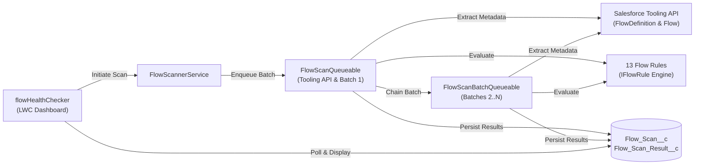

# ⚡ Flow Health Checker

[](https://developer.salesforce.com/)
[-brightgreen.svg>)](https://developer.salesforce.com/)
[](https://developer.salesforce.com/)
[](LICENSE)

**Flow Health Checker** is a Salesforce Managed Package (2GP) that audits, grades, and tracks the health of all active Salesforce Flows within an organization. It identifies anti-patterns, governor-limit risks, missing fault paths, hardcoded values, and UX bottlenecks—giving admins and architects a single 0–100% org health score with actionable remediation steps.

---

## 🌟 Key Features

- 🔍 **Automated Flow Metadata Extraction**: Automatically retrieves active Flow definitions directly via the Salesforce Tooling API without external server dependencies.
- 🛡️ **12 Best Practice & Anti-Pattern Rules**: Comprehensive rule engine covering governor limits, error handling, maintainability, recursion, and UX.
- 📊 **Org Health Scoring Engine**: Intelligent scale-normalized scoring algorithm (0–100%) weighting high-risk Errors 3× over Warnings.
- 💻 **Modern Lightning Dashboard**: Lightning Web Component (`flowHealthChecker`) with interactive flow groups, severity badges, and instant search & filters.
- 🔗 **Flow Builder Deep-Linking**: Jump directly into Salesforce Flow Builder for any affected flow with one click (`↗ Open Flow`).
- 📈 **Scan History & Health Trends**: Visual CSS bar charts tracking org flow health scores over time to demonstrate compliance improvement.
- ⚙️ **Configurable via Custom Metadata**: Enable/disable rules and customize descriptions without modifying Apex code using `Flow_Rule__mdt`.
- 🚀 **Asynchronous Queueable Architecture**: Scalable Queueable batching pipeline that seamlessly audits large enterprise orgs with hundreds of flows without hitting governor limits.

---

## 🏗️ Architecture & How It Works



1. **User triggers scan** via the Flow Health Checker Lightning App.
2. **`FlowScannerService`** creates a pending `Flow_Scan__c` record and enqueues `FlowScanQueueable`.
3. **`FlowMetadataService`** queries active `FlowDefinition` records and fetches full metadata JSON for each flow via the Tooling API.
4. **Rules Engine** parses metadata into object models (`FlowWrapper`) and evaluates each active `IFlowRule`.
5. **Batching**: Large orgs are processed in batches of 20 flows via `FlowScanBatchQueueable` chaining to prevent CPU/heap timeouts and callout limits.
6. **Persistence & Presentation**: Violations are saved to `Flow_Scan_Result__c`, and the dashboard updates in real time with calculated scores and categorized violation lists.

---

## 📋 Built-In Flow Inspection Rules

| Rule                             | Severity     | Rationale & Detection                                                                                                                     |
| -------------------------------- | ------------ | ----------------------------------------------------------------------------------------------------------------------------------------- |
| **DML In Loop**                  | `🔴 Error`   | Flags DML statements (`Create`, `Update`, `Delete`) and `Lookup` operations inside loops that risk hitting the 150 DML / 100 SOQL limits. |
| **No Fault Path**                | `🔴 Error`   | Detects DML/Callout elements without fault connectors, preventing unhandled runtime exceptions from crashing user transactions.           |
| **Hardcoded Id**                 | `🔴 Error`   | Identifies hardcoded 15- and 18-character Salesforce record IDs that cause cross-environment deployment failures.                         |
| **Recursive Subflow**            | `🔴 Error`   | Detects subflow elements that call their own parent flow directly, causing infinite loops and CPU timeouts.                               |
| **Duplicate DML on Same Object** | `🟡 Warning` | Flags multiple separate DML statements on the same SObject outside of loops, suggesting collection-based batching instead.                |
| **Hardcoded URL**                | `🟡 Warning` | Scans for hardcoded external HTTP/HTTPS URLs; recommends Named Credentials or Custom Labels.                                              |
| **Missing Description**          | `🟡 Warning` | Flags flows with blank descriptions to improve documentation and team maintainability.                                                    |
| **No Trigger Configuration**     | `🟡 Warning` | Flags record-triggered flows missing a target SObject on the Start element.                                                               |
| **Too Many Elements**            | `🟡 Warning` | Flags flows with $>30$ elements to encourage modular subflow decomposition.                                                               |
| **Too Many Screen Fields**       | `🟡 Warning` | Flags screen flow nodes with $>10$ fields that degrade user experience and form completion rates.                                         |
| **Unconnected Element**          | `🟡 Warning` | Detects unreachable orphan flow elements and dead code disconnected from the Start element.                                               |
| **Unused Variable**              | `🟡 Warning` | Identifies non-input/output variables that are never referenced in any flow node.                                                         |

---

## 🎯 Org Health Score Formula

Health scores are calculated on a **0% to 100%** scale. Penalties are normalized by total active flow count so single errors in small orgs are weighted appropriately while large enterprise orgs scale cleanly:

$$\text{Error Penalty} = \min\left(\text{Errors} \times \left(\frac{100}{\text{Total Flows}}\right) \times 0.60,\, 100\right)$$

$$\text{Warning Penalty} = \min\left(\text{Warnings} \times \left(\frac{100}{\text{Total Flows}}\right) \times 0.20,\, 100\right)$$

$$\text{Health Score} = \max\left(0,\, \text{round}(100 - \text{Error Penalty} - \text{Warning Penalty})\right)$$

- **$\ge 80\%$ (Green)**: Org flows are in good health.
- **$50\% - 79\%$ (Amber)**: Review recommended; warnings present.
- **$< 50\%$ (Red)**: Critical governor limit or runtime risks detected.

---

## 📦 Package Components

```
force-app/main/default/
├── applications/
│   └── Flow_Health_Checker.app-meta.xml      # Lightning App
├── classes/
│   ├── DmlInLoopRule.cls                     # Rule implementations (13 classes)
│   ├── ...                                   # (All IFlowRule implementations)
│   ├── FlowMetadataService.cls               # Tooling API metadata extraction
│   ├── FlowScannerService.cls                # Scanner engine & rule loader
│   ├── FlowScanQueueable.cls                 # Async Queueable batch 1
│   ├── FlowScanBatchQueueable.cls            # Async Queueable chained batches
│   ├── FlowHealthCheckerController.cls       # LWC Controller
│   ├── FHCPostInstallScript.cls              # Post-install permission assignment
│   ├── FHCUninstallHandler.cls               # Data cleanup handler
│   └── *Test.cls                             # 100% Apex test coverage & mocks
├── customMetadata/                           # 13 Rule Configuration records
├── flexipages/
│   └── Flow_Health_Checker.flexipage-meta.xml # App home page
├── lwc/
│   └── flowHealthChecker/                    # Dashboard UI component
├── objects/
│   ├── Flow_Scan__c/                         # Scan header object
│   ├── Flow_Scan_Result__c/                  # Violation detail object
│   └── Flow_Rule__mdt/                       # Custom metadata type
├── permissionsets/
│   ├── FHC_Admin.permissionset-meta.xml      # Full scan and rule access
│   └── FHC_Viewer.permissionset-meta.xml     # Read-only audit viewer access
└── tabs/
    └── Flow_Health_Checker.tab-meta.xml      # Navigation Tab
```

---

## 🚀 Installation & Getting Started

### 1. Install Managed Package

Install the package into your Salesforce org via web browser:
🔗 **[Direct Installation Link (v0.9.0)](https://login.salesforce.com/packaging/installPackage.apexp?p0=04tdL000000o6gXQAQ)**

Or install via Salesforce CLI:

```bash
sf package install --package "04tdL000000o6gXQAQ" --wait 10 --target-org my-target-org
```

### 2. Assign Permissions

The post-install script automatically assigns `FHC_Admin` to the installing user. To assign permissions to other administrators or auditors:

```bash
# For Administrators (run scans, manage rules):
sf org assign permset --name svfhc__FHC_Admin --target-org my-target-org

# For Read-Only Viewers / Auditors:
sf org assign permset --name svfhc__FHC_Viewer --target-org my-target-org
```

### 3. Open the App

1. Navigate to the Salesforce **App Launcher** (3x3 grid icon).
2. Search for **Flow Health Checker**.
3. Click **Run Scan** to perform an instant health audit of all active flows.

---

## 🛠️ Local Development & Testing

### Prerequisites

- [Salesforce CLI (`sf`)](https://developer.salesforce.com/tools/salesforcecli)
- [Node.js & npm](https://nodejs.org/)

### Setup Scratch Org

```bash
# 1. Clone repository
git clone https://github.com/sourav-the-ace/FlowHealthChecker.git
cd FlowHealthChecker

# 2. Install dev dependencies
npm install

# 3. Create scratch org
sf org create scratch --definition-file config/project-scratch-def.json --alias fhc-scratch --set-default

# 4. Deploy source
sf project deploy start

# 5. Assign permission set
sf org assign permset --name FHC_Admin

# 6. Run Apex unit tests
sf apex test run --code-coverage --result-format human

# 7. Run LWC Jest unit tests
npm run test:unit
```

---

## 📖 In-Depth Project Documentation

For a complete technical breakdown, detailed rule specifications, architecture diagrams, test mock details, and the exhaustive **Gap Analysis & Next Steps**, see:

👉 **[PROJECT_STATUS.md](./PROJECT_STATUS.md)**

---

## 🤝 Contributing & License

Contributions are welcome! Please feel free to submit issues, feature requests, or pull requests.

Distributed under the MIT License.
